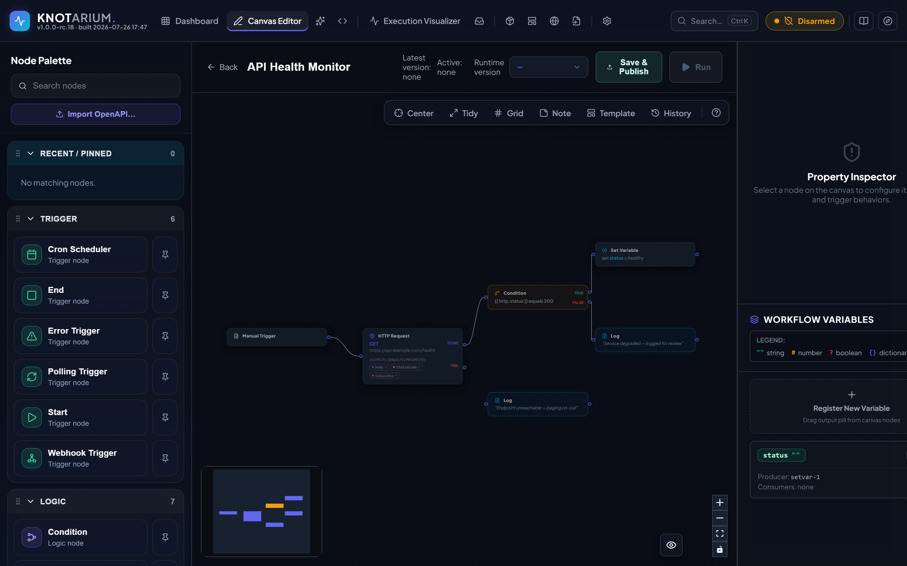

# Knotarium

[](https://github.com/AndreKfm/Knotarium/actions/workflows/ci.yml)
[](LICENSE)
[](CONTRIBUTING.md)

**Self-hosted, visual workflow automation.** Design automations as a graph of nodes on a canvas — HTTP, databases, files, email, message queues, AI/LLM steps and inline C#, with conditionals, `switch`, loops and parallel fan-out/fan-in, and reusable sub-flows. Start them from manual, scheduled, webhook or polling triggers, then run, version (history · diff · restore), and monitor them — with per-workflow credentials, shareable templates, failure alerts, and a dead-letter view with replay.

One .NET process serves both the API and the UI. Storage sits behind a pluggable database-provider seam: **SQLite by default** — zero setup, all data in one local file — with the provider interface already in place for others (a Postgres provider is scaffolded).

> **Note — built with AI, human-verified.** This project was created largely from scratch with AI assistance and reviewed by a human as thoroughly as reasonably possible. It is in early, active development, may still contain errors, and is **not yet production-ready**.



---

## Why Knotarium?

A few things set it apart from the usual JavaScript-based automation tools:

- **One self-contained process — no external runtime or services.** No Node.js, no Python, no separate database server: the API, the UI, and an embedded SQLite database ship as a single self-hosted .NET binary. Run it from a folder, a Docker image, or as a Windows service.
- **Node logic is C#, compiled at runtime.** The inline-code node and custom node packages are real C# compiled with Roslyn on the fly — not a sandboxed scripting layer bolted onto the host.
- **Deterministic gates around AI.** Beyond prompt/router/agent nodes, `AI Verify` and `AI Diff` turn an LLM's answer into structured data that a deterministic rule — *your* logic, not the model — accepts or rejects. The `AI Agent` node's tools are your own allow-listed workflows.
- **Time-travel run inspection + live condition preview.** Step through any past run and see each node's inputs, outputs, and the variables before/after it ran; the condition editor resolves `{{ $node.… }}` references against the last real run, so you can see how a branch will evaluate before you publish.
- **Secure by default.** File access is deny-by-default, the code and database node capabilities are off until you switch them on, and outbound HTTP is checked against an SSRF egress policy.

---

## Download

Prebuilt releases are on the [**Releases page**](https://github.com/AndreKfm/Knotarium/releases) — no build tools required. Every release ships these artifacts (with a matching `.sha256` for each):

| Platform | Artifact | What you get |
|---|---|---|
| **Windows — installer** | `Knotarium-<version>-setup.exe` | Installs Knotarium as an auto-starting **Windows service** on `http://localhost:43120`. |
| **Windows — zero-install** | `Knotarium-<version>-win-x64.zip` | Unzip and run `Start.bat`; runs in the foreground, nothing installed. |
| **Linux** | `Knotarium-<version>-linux-x64.tar.gz` | Self-contained x64 build — extract and run `./Knotarium.Api`. |
| **Any OS — container** | `ghcr.io/andrekfm/knotarium` | Prebuilt multi-arch image (amd64 + arm64) — Docker, Podman, or Windows' native WSL containers (see [Quickstart](#quickstart-container-run) below). |

Verify your download against the published checksum before running, e.g. on Windows:

```powershell
Get-FileHash .\Knotarium-<version>-win-x64.zip   # compare with the matching .sha256 file
```

Then open **http://localhost:43120** and create your admin account on first run. All data (the SQLite database and the auto-generated credential-encryption key) lives in one machine-wide directory, so it survives upgrades and restarts.

> **Windows SmartScreen / Defender note.** Releases are **not yet code-signed**, so Windows may warn about an "unknown publisher" or flag the installer as a false positive on download. The builds are produced reproducibly by [GitHub Actions](.github/workflows/release.yml) straight from this repository — verify the published SHA-256 (and, when set, the VirusTotal links in the release notes). The zero-install `.zip` is affected far less than the installer. Code signing is planned.

---

## Quickstart (container run)

Run the prebuilt image from the GitHub Container Registry — multi-arch (amd64 + arm64), nothing to build:

```bash
docker run -d --name knotarium -p 43120:43120 -v knotarium-data:/data ghcr.io/andrekfm/knotarium:latest
```

On Windows the same image also runs on the built-in WSL container tooling (`wslc`) — no Docker Desktop needed:

```bash
wslc image pull ghcr.io/andrekfm/knotarium:edge
wslc container run -d --name knotarium -p 43120:43120 -v knotarium-data:/data ghcr.io/andrekfm/knotarium:edge
```

The left half of `-p host:container` is yours to choose (e.g. `-p 43121:43120` serves the UI on port 43121 instead). To upgrade later, pull the tag again and recreate the container (`wslc container rm -f knotarium`, then the same `run` command); your data lives in the `knotarium-data` volume and survives.

`:latest` tracks the newest **stable** release. During the current pre-release phase, use `:edge` (newest pre-release) or an exact version tag such as `:1.0.0-rc.15`. Or build from source with Compose instead:

```bash
docker compose up --build
```

Open **http://localhost:43120**. On first run you create an admin account. The SQLite database **and** the auto-generated credential-encryption key persist in the `knotarium-data` volume, so credentials survive restarts with no extra setup.

> Bringing your own encryption key (e.g. to share one across instances)? `export KG_ENCRYPTION_KEY="$(openssl rand -base64 32)"` before `docker compose up`.

> Want to skip login for a throwaway local try? `KG_AUTH_ENABLED=false docker compose up --build`.

**New here?** The [Getting Started guide](docs/getting-started.md) walks you from install to your first API-calling workflow in about five minutes.

## Run from source

Prerequisites: **.NET 10 SDK** and **Node 22+**.

```bash
# Terminal 1 — backend (API on http://localhost:43120)
dotnet run --project Backend/Knotarium.Api

# Terminal 2 — frontend (UI on http://localhost:5273, proxies /api to the backend)
cd Frontend && npm install && npm run dev
```

For a productive single-folder build (backend + bundled UI), Windows users can run `./publish.ps1`.

## Configuration

Set via environment variables (double-underscore = nested config):

| Variable | Purpose |
|---|---|
| `Security__Credentials__EncryptionKeyBase64` | 32-byte base64 key encrypting stored credentials. Optional — auto-generated into the data directory and reused if unset. Set it to bring your own key; then keep it stable, or saved credentials can't be decrypted. |
| `Security__PackageSigning__HostPrivateKeyBase64` | Base64 key to *sign* exported bundles (only needed if you use bundle export). |
| `Auth__Enabled` | Cookie auth. Default `true` (first run creates the admin). |
| `Storage__DataDirectory` | Machine-wide home for the SQLite DB + auto-generated credential key (Docker sets `/data`; defaults to `%ProgramData%\Knotarium` on Windows, `CommonApplicationData/Knotarium` elsewhere). Set it so a Windows service and an interactive run share one DB + key. |
| `Database__ConnectionString` | Overrides the SQLite database file location. Otherwise the DB lives at `<DataDirectory>/Knotarium.db`. (Only the SQLite provider is implemented today; the provider seam has a scaffolded Postgres stub for the future.) |

For local development, copy `Backend/Knotarium.Api/appsettings.Development.json.example` to `appsettings.Development.json` (gitignored) and fill in your own keys.

## Features

- **Self-contained** — a single .NET process serves the API and UI over an embedded SQLite database; no Node.js, Python, or external services to run. Ship it as a folder, a Docker image, or a Windows service.
- **Visual canvas** — drag/connect nodes, auto-layout, undo/redo, node search, sub-flow drill-down, sticky notes & groups.
- **Nodes** — HTTP, database query, file read/write, email (SMTP/IMAP), MQTT publish, conditionals, loops (incl. parallel), delay, inline C# code, and custom node packages.
- **Triggers** — manual, webhook, cron schedule, polling, error-handler, and event-driven device blocks.
- **Execution & debugging** — journaled runs with a time-travel inspector (step through each node's inputs, outputs, and variables before/after); live condition preview against the last run; runtime versioning (publish + activate, with history · diff · restore).
- **Reliability** — global error workflow, dead-letter queue with replay, failure-alert channels (webhook/Slack/email).
- **Portability** — export/import single-workflow templates and multi-package bundles; full encrypted backup/restore; import from an OpenAPI spec.
- **AI** — prompt, router, and agent nodes (the agent's tools are your own allow-listed workflows); deterministic `Verify` / `Diff` gates that turn LLM output into pass/fail on *your* rules; and one-shot workflow generation from a natural-language description.
- **Security** — deny-by-default file-access policy, capability gating for code/database nodes, cookie auth, and privileged-node warnings on import (see below).

## Security

This is an automation engine that can **execute code and touch the filesystem**, so treat a running instance as privileged:

- The **inline-code** and **database** node capabilities are **off by default** — enable them in *Settings → Capabilities* only if you trust every workflow on the instance.
- **File Read/Write** is **deny-by-default**; grant specific directories in *Settings → File Access* (path-traversal and symlink escapes are blocked server-side).
- **Do not expose an instance directly to the public internet** without putting it behind your own authentication/reverse-proxy and a threat model.

Found a vulnerability? Please follow the process in [SECURITY.md](SECURITY.md) rather than opening a public issue.

## Tech

.NET 10 (modular-monolith backend, SQLite) · React 19 + Vite + React Flow (frontend). ~1,750 automated tests.

## Development

Knotarium is built with heavy use of **AI-assisted development** (Claude Code). Every change is human-reviewed, gated on CI, and maintained by [@AndreKfm](https://github.com/AndreKfm).

**A note on the git history:** this project was developed in a private repository, and the public history is not representative of how the work actually unfolded. It was squashed and cleaned up before open-sourcing, so the commit log here is a condensed snapshot — not a faithful record of the development timeline, the order things were built in, or the number of iterations behind each feature. Treat the code as the artifact; don't read the commit graph as a chronicle of the process.

## License

[Apache License 2.0](LICENSE) — see [NOTICE](NOTICE) for attribution and [THIRD-PARTY-NOTICES.md](THIRD-PARTY-NOTICES.md) for bundled open-source components.

## Contributing

Contributions are welcome. Please read [CONTRIBUTING.md](CONTRIBUTING.md) and our [Code of Conduct](CODE_OF_CONDUCT.md) before opening a pull request.
