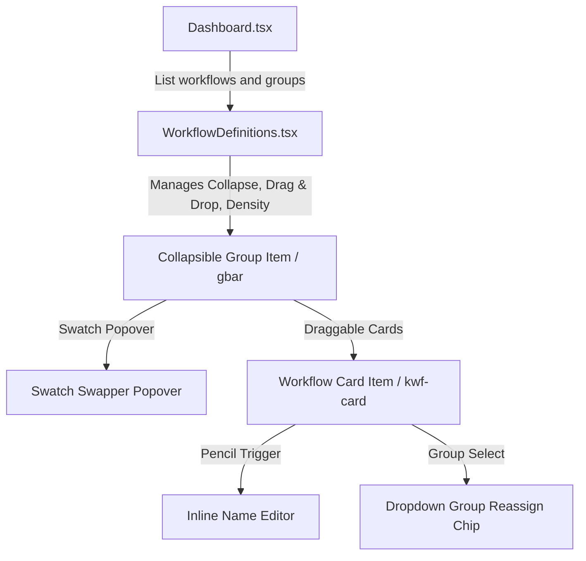

# Workflow Grouping Specification & Migration Guide

This document defines the architecture, data models, persistence mechanics, and user interactions for implementing custom, group-centric visual workspace management in Knotarium.

---

## 1. Architectural Philosophy & Strategy

Workflow grouping is purely an **organizational overlay** (a tagging/labeling metaphor) rather than a strict database container constraint. 
To preserve developer autonomy, seamless teamwork, and robust Git-based revision controls, we employ a hybrid storage strategy:

### Storage Architecture Selection: **Option A (Parallel file store in Workspace)**
1. **Workspace Root Storage Directory**:
   All files are stored relative to the workspace/repository root folder, ensuring full compatibility with Git-based review, staging, and collaboration.
   ```
   Workspace
   ├── workflows/
   │   ├── workflow-a.json
   │   └── workflow-b.json
   └── groups.json
   ```
2. **Groups Inventory (`groups.json`)**: Custom groups, including their metadata (stable generated ID, name, color), are persisted in a centralized configuration file in the workspace root under `groups.json`. It is structured as a versioned object rather than a bare array for long-term migration safety.
3. **Workflow Group Property**: Individual workflow draft files underneath the `workflows/` directory store their current group affiliation under a clean `"metadata"` object block with a `"group"` string property. The persisted draft format should serialize `"metadata": { "group": null }` when the workflow is explicitly ungrouped, rather than silently omitting the object, so frontend and backend behavior stay aligned.
4. **Database & Build Isolation**: During build/compilation, any metadata properties present on the draft are completely ignored by the compiler/runtime execution registry to avoid polluting domain runtime execution models.

### Git Conflict Mitigation & Collaboration Reality
Workflow-to-group assignments are stored per-workflow under the `"metadata"` object to minimize conflicts. Group metadata remains centralized in `groups.json`, so concurrent group edits (like adding a group, reordering, or color swatches) may still require normal Git conflict resolution. Reordering is intentionally modeled as replacing the full `groups` array, which keeps the wire contract simple but maximizes merge pressure on `groups.json`; if reordering becomes a high-frequency action later, an explicit `order` field can be introduced as a follow-up refinement.

---

## 2. Component Hierarchy & UX Flow



### Deletion Safety Pattern: **Delete-with-Reassign + Confirmation Guard**
We reject "block until empty" patterns, as they create user friction. Group deletion must be non-destructive to the workflows inside it:
* **Empty Group**: Silent deletion.
* **Non-Empty Group**: Light modal confirmation: 
  > *"Delete 'Production'? Its 3 workflows will move to Ungrouped."*
* **On Confirm**: The group record is removed from `groups.json` first, and assigned workflow files are then rewritten to set `"group"` to `null`. This ordering is deliberate: orphaned references already degrade safely to the "Ungrouped" pseudo-section on read, so removing the group first preserves a consistent state even if the process stops mid-cleanup.

---

## 3. Data Schema Definitions

### Frontend Schema

```typescript
// Frontend typings
export interface WorkflowGroup {
  id: string;      // Stable generated ID, never derived from name (e.g. grp_01HZY...)
  name: string;    // Editable display name (trim first, then validate <= 80 chars)
  color: string;   // Hex color string (validated format #RRGGBB)
}

export interface WorkflowGroupContainer {
  version: number;
  groups: WorkflowGroup[];
}

export interface WorkflowMetadata {
  group?: string | null;  // Association reference
}

export interface WorkflowDefinition {
  id: { value: string };
  name: string;
  nodes: NodeDefinition[];
  edges: EdgeDefinition[];
  metadata?: WorkflowMetadata | null;
}
```

### Backend Domain Entities

```csharp
// Backend domain models (Knotarium.Core/Domain)
namespace Knotarium.Core.Domain;

public record GroupDefinition(string Id, string Name, string Color);

public record GroupContainer(int Version, IReadOnlyList<GroupDefinition> Groups); // Version is for schema evolution only

public record WorkflowMetadata(string? Group = null);

public record WorkflowDefinition(
    WorkflowDefinitionId Id,
    string Name,
    IReadOnlyList<NodeDefinition> Nodes,
    IReadOnlyList<EdgeDefinition> Edges,
    WorkflowMetadata? Metadata = null); // Cleaner Metadata parameter
```

---

## 4. API Endpoint Contract

All group-related endpoints operate directly on the configuration path.

### `GET /api/workflow-groups`
* **Response**: `200 OK` with JSON object:
  ```json
  {
    "version": 1,
    "groups": [
      { "id": "grp_production", "name": "Production", "color": "#4F46E5" }
    ]
  }
  ```
* **Response Headers**: `ETag: "content-hash"` computed from the exact serialized `groups.json` bytes on disk.

### `PUT /api/workflow-groups`
* **Request Headers**: `If-Match: "computed-etag-or-hash"`
* **Request Body**: Complete `GroupContainer` payload containing list of `GroupDefinition[]` (enables group reordering)
* **Concurrency Authority**: `If-Match` is the authoritative optimistic concurrency token. `GroupContainer.version` is not incremented per edit and must only change when the JSON schema shape changes.
* **ETag Semantics**: The server compares `If-Match` against the current content-based ETag while holding the workspace file lock, then writes the new file and returns the ETag for the bytes actually persisted.
* **Response**:
  * `428 Precondition Required` if `If-Match` is missing
  * `200 OK`
  * `412 Precondition Failed` if the ETag no longer matches the current file contents

### `DELETE /api/workflow-groups/{id}`
* **Effect**: Remap assigned workflows in workspace to `null`, delete group profile from `groups.json` safely. Idempotent.
* **Response**:
  * `204 NoContent` if successful
  * `400 BadRequest` if the group ID syntax is invalid

`400` is reserved for malformed IDs only. An unknown but syntactically valid group ID still returns `204` to preserve idempotent delete semantics.

---

## 5. Handoff Step-by-Step Implementation Blueprint

### Step 1: Core Domain Alignment
1. Modify [Backend/Knotarium.Core/Domain/WorkflowDefinition.cs](Backend/Knotarium.Core/Domain/WorkflowDefinition.cs). Inject `WorkflowMetadata? Metadata = null` into the constructor and JSON serialization contracts.
2. Define the `GroupDefinition` and `GroupContainer` records.

### Step 2: Storage Infrastructure & Validation Rules
1. Define clear validation rules on group updates:
   * `id`: Required, stable, unique, matching regexp `grp_[a-zA-Z0-9_-]+`
   * `name`: Required, trim first, then validate max length 80 characters.
   * `color`: Required, valid `#RRGGBB` hex string.
2. Open [Backend/Knotarium.Infrastructure/Persistence/FileWorkflowStore.cs](Backend/Knotarium.Infrastructure/Persistence/FileWorkflowStore.cs):
   * Declare helper paths calling `Path.Combine(_storeFolder, "groups.json")`, where `_storeFolder` is the workspace root directory that sits beside `workflows/`, not the `workflows/` subdirectory itself.
   * Add `Task<GroupContainer> ListGroupsAsync()` and `Task SaveGroupsAsync(GroupContainer container)` using `System.Text.Json` with atomic writes (via temp files + swap/replace).
   * On read, handle orphaned assignments dynamically: if a workflow belongs to an unknown or deleted group ID, display as `Ungrouped` without crashing.
   * Use a non-reentrant lock layering pattern: public store methods acquire `_workspaceLock` exactly once, then delegate to private `...UnlockedAsync` helpers that never take the lock and never call back into public methods.
   * Do not rely on a fictional `SemaphoreSlim.AcquireAsync()` API. Either use `await _workspaceLock.WaitAsync(ct)` with `try/finally { _workspaceLock.Release(); }`, or define a small helper extension that wraps that pattern explicitly.
   * Compute the optimistic concurrency ETag from the exact serialized `groups.json` bytes written to disk. Validate `If-Match` and perform the compare-and-swap while the workspace lock is held so concurrent requests cannot both pass the check.
   * Implement a robust, safe delete operation using the same lock and unlocked helpers:
     ```csharp
     private readonly SemaphoreSlim _workspaceLock = new(1, 1);

     public async Task<GroupContainer> ListGroupsAsync(CancellationToken ct = default)
     {
         await _workspaceLock.WaitAsync(ct);
         try
         {
             return await ReadGroupsUnlockedAsync(ct);
         }
         finally
         {
             _workspaceLock.Release();
         }
     }

     public async Task DeleteGroupAsync(string groupId, CancellationToken ct = default)
     {
         await _workspaceLock.WaitAsync(ct);
         try
         {
             var container = await ReadGroupsUnlockedAsync(ct);
             if (container.Groups.All(g => g.Id != groupId))
             {
                 return; // Idempotent no-op for unknown but valid IDs
             }

             // Remove the group first. Any workflows still referencing the old ID
             // are treated as Ungrouped on read until cleanup completes.
             var updatedGroups = container.Groups.Where(g => g.Id != groupId).ToList();
             await WriteGroupsUnlockedAsync(container with { Groups = updatedGroups }, ct);

             var drafts = await ReadAllDraftsUnlockedAsync(ct);
             foreach (var draft in drafts)
             {
                 if (draft.Metadata?.Group != groupId)
                 {
                     continue;
                 }

                 var updated = draft with
                 {
                     Metadata = new WorkflowMetadata(Group: null)
                 };

                 await WriteDraftUnlockedAsync(updated, ct);
             }
         }
         finally
         {
             _workspaceLock.Release();
         }
     }
     ```
   * Treat crash-safety, not cross-file atomicity, as the design goal. Removing the group first means any partial cleanup still leaves the workspace in a readable and deterministic state because orphaned assignments degrade to `Ungrouped`.

### Step 3: Web API Controllers Setup
1. Route endpoints in [Backend/Knotarium.Api/Program.cs](Backend/Knotarium.Api/Program.cs):
   * Mapping `GET`, `PUT` (with required optimistic ETag `If-Match` validation), and `DELETE`.
   * Return the current `ETag` header from `GET`, require `If-Match` on `PUT`, and perform the ETag comparison under the store lock before persisting changes.
   * Use `412 Precondition Failed` for stale ETags and reserve `409 Conflict` for future semantic conflicts that are not precondition-based.
   * Ensure group file operations are completely isolated from SQLite execution persistence. The in-process semaphore guards concurrent writes within the API process; the ETag guards concurrent edits from other processes or Git-driven file changes.

### Step 4: UI Development (Frontend)
1. Add APIs inside [Frontend/src/utils/api.ts](Frontend/src/utils/api.ts) mapping backend actions (including ETag headers).
2. Build [Frontend/src/components/WorkflowDefinitions.tsx](Frontend/src/components/WorkflowDefinitions.tsx) fully translating `docs/design/WorkflowDefinitions.jsx` into TypeScript, complete with:
   * comfortable vs. compact mode selectors.
   * color dot color-swapping palette on click.
   * inline group & workflow rename handlers.
   * modal backdrop confirmation portal when deleting a non-empty group.
3. Wire [Frontend/src/components/Dashboard.tsx](Frontend/src/components/Dashboard.tsx) to mount `WorkflowDefinitions` inside our dashboard control interface.
